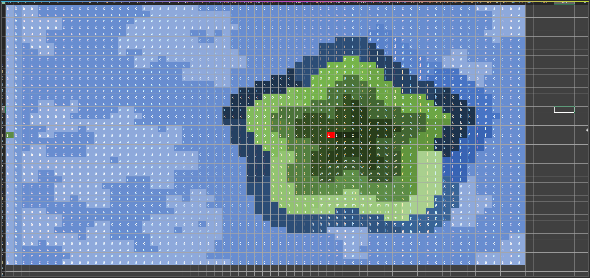
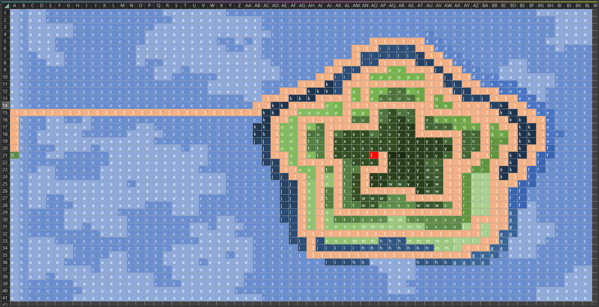

# Day 12

yes its special today. didnt wanna do pathfinding shit so i made a program that converts the input to csv.

then i loaded that to excel and started color coding the letters.

then i manually "walked" the path and wrote a 1 for each field i visited (so that i can check with ctrl+f how many 1s there are :) )

my result for task 1: 370

